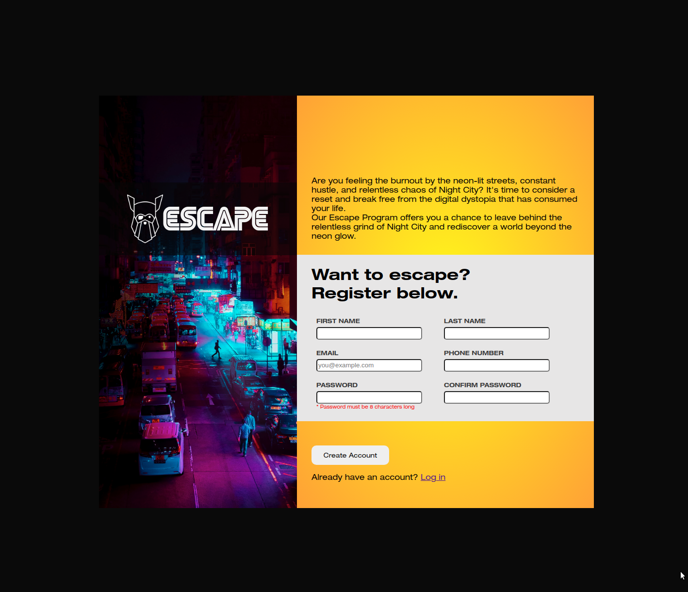

# The Odin Project - Submit Form attempt #
## [Link to live demo](https://03tb.github.io/signup-form "Live Demo Link") ##

My completed form looks like this

## New Things Learnt ##

- [x] Use of keyframes to make minor animations e.g. password validation and button hover
- [x] Adding classes to error messages makes it easier to remove them so that the message does not keep repeatedly getting inserted by the DOM.

## Things to do to improve my attempt ##
- [ ] Responsive styling
- [ ] Adding more validation to the fields, currently only applied to the password.
    - [ ] First name required
    - [ ] Email required
    - [ ] Phone number required (?)
    - [ ] Adding RegEx for pattern validation
